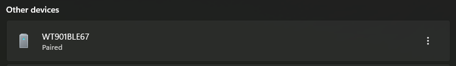
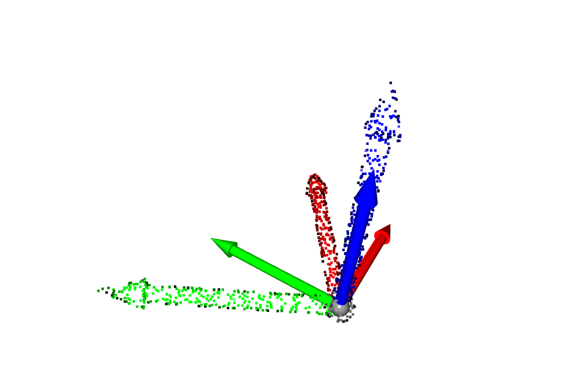

# witmotion_visualizer

witmotionのWT901BLECLの値を取得し、Open3Dでリアルタイム表示するスクリプトたち

# 使い方

## 1. 接続

PCとデバイスをBluetoothで接続する



## 2. MACアドレスの確認

`scan_ble_devices.py`を使って接続中のBLEデバイスのMACアドレス一覧を取得

WT901BLExxのMACアドレスを控えておく

```
> python scan_ble_devices.py
address: C7:64:C1:C7:64:C2, name: WM2, uuid: ['0000fd81-0000-1000-8000-00805f9b34fb']
address: 00:1C:FC:78:73:CA, name: None, uuid: ['cbbfe0e2-f7f3-4206-84e0-84cbb3d09dfc']
address: 0C:02:BD:9E:52:89, name: None, uuid: ['0000fd6f-0000-1000-8000-00805f9b34fb']
address: 66:0D:F8:BF:25:7B, name: None, uuid: ['0000fe9f-0000-1000-8000-00805f9b34fb']
address: 5C:B6:8F:87:88:AF, name: None, uuid: ['cbbfe0e2-f7f3-4206-84e0-84cbb3d09dfc']
address: 74:D7:CA:E4:20:AD, name: BTU1324r, uuid: ['00000000-ffff-4489-0000-ffa28cde82ab']
address: 58:DA:5B:12:04:6C, name: None, uuid: ['0000fe9f-0000-1000-8000-00805f9b34fb']
address: D6:C4:38:A6:EA:C7, name: None, uuid: ['cba20d00-224d-11e6-9fb8-0002a5d5c51b']
address: EA:78:B5:4D:E3:21, name: WT901BLE67, uuid: ['0000ffe5-0000-1000-8000-00805f9a34fb']
address: D2:2E:9D:D5:BC:05, name: None, uuid: ['cba20d00-224d-11e6-9fb8-0002a5d5c51b']
```

## 3. mainにMACアドレスを書き込み

`main.py`にさっきのMACアドレスを書いて実行

```python
sensor = WitMotionSensor("EA:78:B5:4D:E3:21")
```



座標矢印は、赤がx軸、緑がy軸、青がz軸

点群の方はグローバルの固定座標(回転がすべてゼロの位置)でメッシュがIMUの現在の姿勢を示す

接続が上手くいかないこともあるので、何度かやり直す必要があるかも
